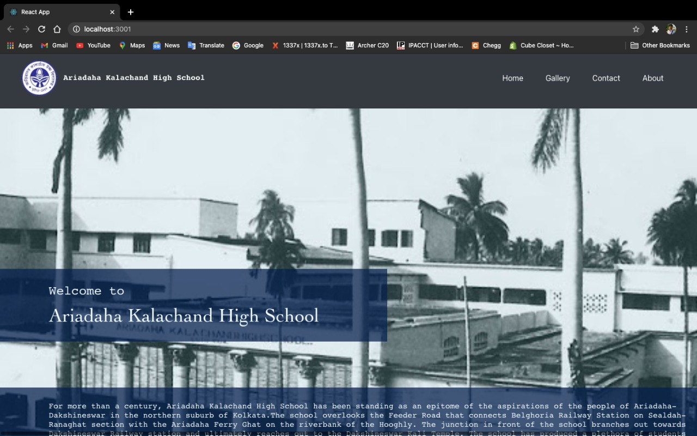
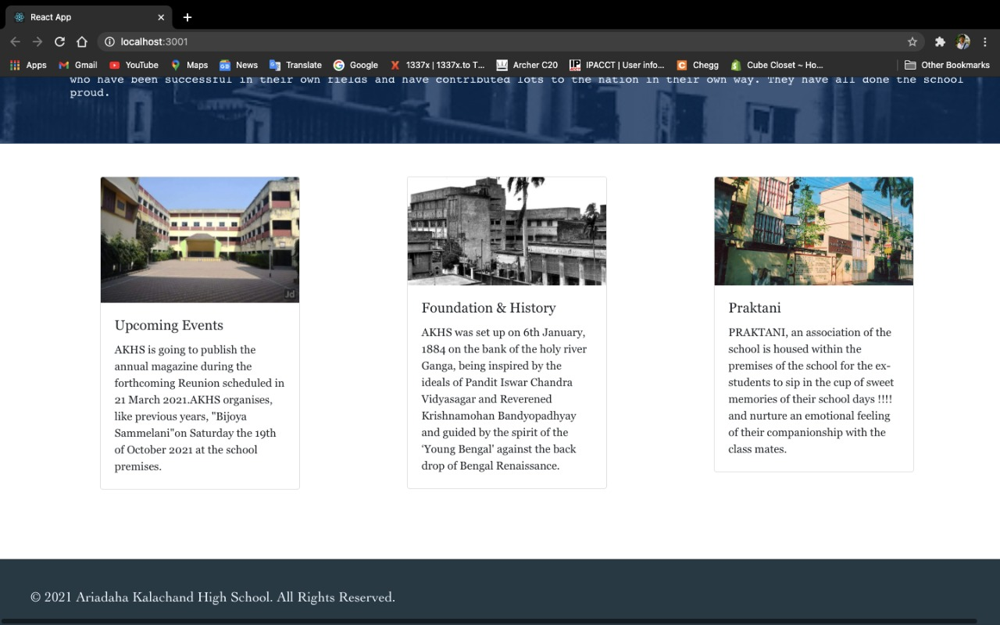

# Ariadaha Kalachand High School (AKHS App)

This is a demo app build by me in April 2021 on request of one of my friend. It's tribute to my school from my end. This is a single page basic website with potential to be extended into multipage app for displaying information, courses and releted sutffs.

## Overview of the School

For more than a century, Ariadaha Kalachand High School has been standing as an epitome of the aspirations of the people of Ariadaha-Dakshineswar in the northern suburb of Kolkata.The school overlooks the Feeder Road that connects Belghoria Railway Station on Sealdah-Ranaghat section with the Ariadaha Ferry Ghat on the riverbank of the Hooghly. The junction in front of the school branches out towards Dakshineswar Railway station and ultimately reaches out to the Dakshineswar Kali Temple. The school has produced a plethora of students who have been successful in their own fields and have contributed lots to the nation in their own way. They have all done the school proud.

AKHS was set up on 6th January 1884 on the bank of the holy river Ganga, being inspired by the ideals of Pandit Iswar Chandra Vidyasagar and Reverend Krishnamohan Bandyopadhyay and guided by the spirit of the ‘Young Bengal' against the backdrop of Bengal Renaissance.

This school is now managed by the West Bengal Ministry of Education and is currently situated in the district of North 24 Parganas (Kamarhati Municipality). Currently Bengali is the primary medium of instruction in this school. The school is for boys and consists of Grades from 5 to 12 and is taught as per the guidelines of the West Bengal Board of Secondary Education and the West Bengal Council of Higher Secondary Education. The academic session starts in January.

## Tools and Technologies

* React 
* HTML
* CSS
* Java Script
* NPM

## Application Screenshorts

Upper Part:

Lower Part:

